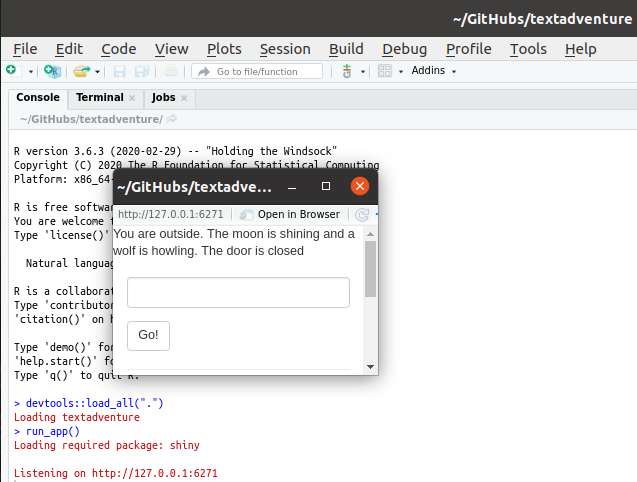

# textadventure

Branch   |[](https://travis-ci.org)                                                |[](https://www.codecov.io)
---------|--------------------------------------------------------------------------------------------------------------------|--------------------------------------------------------------------------------------------------------------------------------------------------
`master` |[](https://travis-ci.org/informalr/textadventure) |[](https://codecov.io/github/informalr/textadventure/branch/master)
`develop`|[](https://travis-ci.org/informalr/textadventure)|[](https://codecov.io/github/informalr/textadventure/branch/develop)
`richel` |[](https://travis-ci.org/informalr/textadventure)|[](https://codecov.io/github/informalr/textadventure/branch/richel)
`willy`  |[](https://travis-ci.org/informalr/textadventure)|[](https://codecov.io/github/informalr/textadventure/branch/willy)

Text adventure using Shiny.



Start the text adventure by:

```{r}
library(textadventure)
start_app()
```


